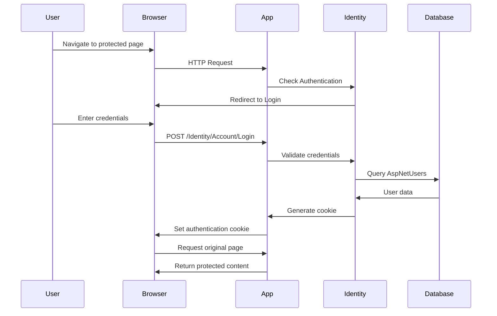

ESP Santa Fe de Antioquia uses ASP.NET Core Identity for authentication and authorization, with cookie-based authentication for session management.

## Identity Configuration

Identity is configured in `Startup.cs:32` with custom options:

```csharp
services.AddIdentity<IdentityUser, IdentityRole>(
    options => options.SignIn.RequireConfirmedAccount = true)
   .AddEntityFrameworkStores<ApplicationDbContext>()
   .AddDefaultTokenProviders();
```

<Note>
  **RequireConfirmedAccount**: Users must confirm their email address before they can sign in, enhancing security.
</Note>

## Authentication Flow



## Password Requirements

Password policies are configured in `Startup.cs:42`:

```csharp
services.Configure<IdentityOptions>(options =>
{
    // Password settings
    options.Password.RequireDigit = false;
    options.Password.RequireLowercase = false;
    options.Password.RequireNonAlphanumeric = false;
    options.Password.RequireUppercase = true;
    options.Password.RequiredLength = 4;
    options.Password.RequiredUniqueChars = 0;
});
```

<Tabs>
  <Tab title="Requirements">
    | Setting | Value | Description |
    |---------|-------|-------------|
    | **RequiredLength** | 4 | Minimum password length |
    | **RequireUppercase** | true | Must contain uppercase letter |
    | **RequireDigit** | false | Numbers optional |
    | **RequireLowercase** | false | Lowercase optional |
    | **RequireNonAlphanumeric** | false | Special characters optional |
    | **RequiredUniqueChars** | 0 | No unique character requirement |
  </Tab>
  
  <Tab title="Example Passwords">
    Valid passwords:
    - `Admin123`
    - `Password`
    - `TEST`
    
    Invalid passwords:
    - `abc` (too short)
    - `test` (no uppercase)
    - `12` (too short, no uppercase)
  </Tab>
  
  <Tab title="Security Note">
    <Warning>
      The current configuration (`RequiredLength = 4`, minimal requirements) is suitable for development but should be strengthened for production:
      
      ```csharp
      // Recommended production settings
      options.Password.RequireDigit = true;
      options.Password.RequireLowercase = true;
      options.Password.RequireNonAlphanumeric = true;
      options.Password.RequireUppercase = true;
      options.Password.RequiredLength = 8;
      options.Password.RequiredUniqueChars = 4;
      ```
    </Warning>
  </Tab>
</Tabs>

## Account Lockout

Protection against brute-force attacks is configured in `Startup.cs:52`:

```csharp
services.Configure<IdentityOptions>(options =>
{
    // Lockout settings
    options.Lockout.DefaultLockoutTimeSpan = TimeSpan.FromMinutes(5);
    options.Lockout.MaxFailedAccessAttempts = 5;
    options.Lockout.AllowedForNewUsers = true;
});
```

**How it works**:
1. After 5 failed login attempts
2. Account is locked for 5 minutes
3. Applies to all users, including new accounts

<Accordion title="Lockout Timeline Example">
  ```
  Attempt 1: Failed - No lockout
  Attempt 2: Failed - No lockout
  Attempt 3: Failed - No lockout
  Attempt 4: Failed - No lockout
  Attempt 5: Failed - Account locked for 5 minutes
  
  [5 minutes pass]
  
  Next attempt: Allowed (counter resets if successful)
  ```
</Accordion>

## User Settings

User configuration in `Startup.cs:57`:

```csharp
services.Configure<IdentityOptions>(options =>
{
    // User settings
    options.User.AllowedUserNameCharacters =
        "abcdefghijklmnopqrstuvwxyzABCDEFGHIJKLMNOPQRSTUVWXYZ0123456789-._@+";
    options.User.RequireUniqueEmail = false;
});
```

- **Allowed Username Characters**: Letters, numbers, and `-._@+` symbols
- **RequireUniqueEmail**: `false` allows multiple accounts with same email

## Cookie Authentication

Cookie settings are configured in `Startup.cs:63`:

```csharp
services.ConfigureApplicationCookie(options =>
{
    // Cookie settings
    options.Cookie.HttpOnly = true;
    options.ExpireTimeSpan = TimeSpan.FromMinutes(180);

    options.LoginPath = "/Identity/Account/Login";
    options.AccessDeniedPath = "/Identity/Account/AccessDenied";
    options.SlidingExpiration = true;
});
```

<Tabs>
  <Tab title="Cookie Settings">
    | Setting | Value | Description |
    |---------|-------|-------------|
    | **HttpOnly** | true | Cookie not accessible via JavaScript (XSS protection) |
    | **ExpireTimeSpan** | 180 minutes | Cookie expires after 3 hours |
    | **SlidingExpiration** | true | Cookie renewed on each request |
    | **LoginPath** | `/Identity/Account/Login` | Redirect URL for unauthenticated users |
    | **AccessDeniedPath** | `/Identity/Account/AccessDenied` | Redirect for unauthorized access |
  </Tab>
  
  <Tab title="Sliding Expiration">
    With sliding expiration enabled:
    
    ```
    12:00 PM - User logs in (expires at 3:00 PM)
    12:30 PM - User makes request (expires at 3:30 PM)
    1:00 PM - User makes request (expires at 4:00 PM)
    ... continues while user is active
    ```
    
    If no activity:
    ```
    12:00 PM - User logs in (expires at 3:00 PM)
    [No activity]
    3:00 PM - Cookie expires, user must log in again
    ```
  </Tab>
  
  <Tab title="Security Benefits">
    - **HttpOnly**: Prevents XSS attacks from stealing cookies
    - **Sliding Expiration**: Balance between security and usability
    - **Timeout**: Limits exposure if user forgets to log out
    - **HTTPS Only**: Recommended in production for encryption
  </Tab>
</Tabs>

## Token Lifespans

Data protection tokens (password reset, email confirmation) are configured in `Startup.cs:38`:

```csharp
services.Configure<DataProtectionTokenProviderOptions>(o =>
    o.TokenLifespan = TimeSpan.FromDays(7));
```

**Token Types**:
- Email confirmation tokens: Valid for 7 days
- Password reset tokens: Valid for 7 days
- Phone number confirmation: Valid for 7 days

## Identity Pages

The application uses scaffolded Identity pages in the `Areas/Identity/` directory:

<Accordion title="Available Identity Pages">
  **Account Management**:
  - `/Identity/Account/Login` - User login
  - `/Identity/Account/Logout` - User logout
  - `/Identity/Account/Register` - New user registration
  - `/Identity/Account/ForgotPassword` - Password reset request
  - `/Identity/Account/ResetPassword` - Password reset form
  - `/Identity/Account/AccessDenied` - Authorization failure
  
  **Profile Management** (`/Identity/Account/Manage/`):
  - `Index` - Profile information
  - `Email` - Change email
  - `ChangePassword` - Change password
  - `TwoFactorAuthentication` - 2FA settings
  - `PersonalData` - GDPR data management
  - `DeletePersonalData` - Account deletion
</Accordion>

## Database Schema

Identity extends the database with authentication tables:

```csharp
// ApplicationDbContext.cs:9
public class ApplicationDbContext :
    IdentityDbContext<IdentityUser, IdentityRole, string>
{
    // Application DbSets
    public DbSet<Category> Categories { get; set; }
    public DbSet<Product> Products { get; set; }
    // ... more entities
}
```

**Identity Tables**:
- `AspNetUsers` - User accounts
- `AspNetRoles` - User roles
- `AspNetUserRoles` - User-role relationships
- `AspNetUserClaims` - Custom user claims
- `AspNetUserLogins` - External authentication providers
- `AspNetUserTokens` - Authentication tokens
- `AspNetRoleClaims` - Role-based claims

## Authorization in Controllers

Protect actions with the `[Authorize]` attribute:

```csharp
using Microsoft.AspNetCore.Authorization;

[Authorize]  // Entire controller requires authentication
public class ProductsController : Controller
{
    public async Task<IActionResult> Index()
    {
        // Only authenticated users can access
        return View(await _productService.GetAll());
    }
    
    [AllowAnonymous]  // Override - allow public access
    public async Task<IActionResult> ListProducts()
    {
        return View(await _productService.GetAll());
    }
}
```

### Role-Based Authorization

```csharp
[Authorize(Roles = "Admin")]
public class AdminController : Controller
{
    public IActionResult Dashboard()
    {
        // Only Admin role can access
        return View();
    }
}

[Authorize(Roles = "Admin,Manager")]
public IActionResult Reports()
{
    // Admin OR Manager can access
    return View();
}
```

### Claims-Based Authorization

```csharp
[Authorize(Policy = "RequireAdminRole")]
public class AdminController : Controller
{
    // Protected by custom policy
}
```

Define policies in `Startup.cs`:
```csharp
services.AddAuthorization(options =>
{
    options.AddPolicy("RequireAdminRole", 
        policy => policy.RequireRole("Admin"));
});
```

## Authorization in Views

Show/hide UI elements based on authentication:

```razor
@using Microsoft.AspNetCore.Identity
@inject SignInManager<IdentityUser> SignInManager
@inject UserManager<IdentityUser> UserManager

@if (SignInManager.IsSignedIn(User))
{
    <a asp-area="Identity" asp-page="/Account/Manage/Index">
        Hello @User.Identity.Name!
    </a>
    <form asp-area="Identity" asp-page="/Account/Logout">
        <button type="submit">Logout</button>
    </form>
}
else
{
    <a asp-area="Identity" asp-page="/Account/Register">Register</a>
    <a asp-area="Identity" asp-page="/Account/Login">Login</a>
}
```

Role-based view rendering:
```razor
@if (User.IsInRole("Admin"))
{
    <a asp-controller="Admin" asp-action="Dashboard">Admin Dashboard</a>
}
```

## Middleware Pipeline

Authentication middleware is registered in `Startup.cs:119`:

```csharp
public void Configure(IApplicationBuilder app, IWebHostEnvironment env)
{
    app.UseHttpsRedirection();
    app.UseStaticFiles();
    app.UseRouting();
    
    // Authentication must come before Authorization
    app.UseAuthentication();
    app.UseAuthorization();
    
    app.UseEndpoints(endpoints =>
    {
        endpoints.MapControllerRoute(
            name: "default",
            pattern: "{controller=Home}/{action=Index}/{id?}");
        endpoints.MapRazorPages();  // Required for Identity pages
    });
}
```

<Warning>
  **Order Matters**: `UseAuthentication()` must be called before `UseAuthorization()`. Authentication identifies the user, authorization determines what they can access.
</Warning>

## Security Best Practices

<CardGroup cols={2}>
  <Card title="HTTPS Only" icon="lock">
    Always use HTTPS in production to encrypt authentication cookies and prevent interception
  </Card>
  <Card title="Strong Passwords" icon="key">
    Enforce strong password requirements (8+ characters, complexity requirements)
  </Card>
  <Card title="Account Lockout" icon="ban">
    Enable lockout to prevent brute-force attacks
  </Card>
  <Card title="Email Confirmation" icon="envelope-circle-check">
    Require email confirmation to verify user identity
  </Card>
  <Card title="Cookie Security" icon="cookie">
    Use HttpOnly, Secure, and SameSite cookie attributes
  </Card>
  <Card title="Token Expiration" icon="clock">
    Keep token lifespans reasonable (not too long)
  </Card>
</CardGroup>

## Production Hardening

For production environments, enhance security:

<Tabs>
  <Tab title="Password Policy">
    ```csharp
    options.Password.RequireDigit = true;
    options.Password.RequireLowercase = true;
    options.Password.RequireNonAlphanumeric = true;
    options.Password.RequireUppercase = true;
    options.Password.RequiredLength = 8;
    options.Password.RequiredUniqueChars = 4;
    ```
  </Tab>
  
  <Tab title="Cookie Security">
    ```csharp
    options.Cookie.HttpOnly = true;
    options.Cookie.SecurePolicy = CookieSecurePolicy.Always;  // HTTPS only
    options.Cookie.SameSite = SameSiteMode.Strict;  // CSRF protection
    options.ExpireTimeSpan = TimeSpan.FromMinutes(30);  // Shorter timeout
    ```
  </Tab>
  
  <Tab title="Additional Measures">
    - Enable two-factor authentication (2FA)
    - Implement rate limiting on login attempts
    - Use Azure AD or external providers for SSO
    - Regular security audits and updates
    - Monitor failed login attempts
    - Implement password history to prevent reuse
  </Tab>
</Tabs>

## User Management

Access user information in controllers:

```csharp
public class ProfileController : Controller
{
    private readonly UserManager<IdentityUser> _userManager;

    public ProfileController(UserManager<IdentityUser> userManager)
    {
        _userManager = userManager;
    }

    public async Task<IActionResult> Index()
    {
        var user = await _userManager.GetUserAsync(User);
        var roles = await _userManager.GetRolesAsync(user);
        
        return View(new ProfileViewModel 
        { 
            Email = user.Email,
            Roles = roles
        });
    }
}
```

## Next Steps

<CardGroup cols={2}>
  <Card title="API Reference" icon="book" href="/api/controllers">
    Explore controllers and authorization
  </Card>
  <Card title="Database Schema" icon="database" href="/architecture/database-schema">
    Review Identity database tables
  </Card>
  <Card title="Services Layer" icon="code" href="/architecture/services-layer">
    Understand service layer patterns
  </Card>
  <Card title="Deployment" icon="rocket" href="/deployment/getting-started">
    Deploy with secure authentication
  </Card>
</CardGroup>