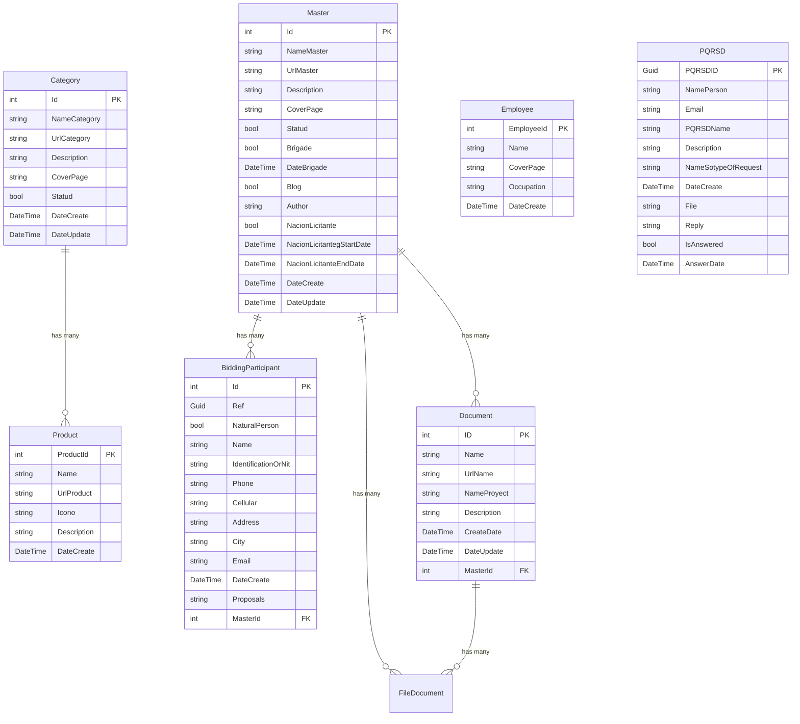

The application uses Entity Framework Core with SQL Server for data persistence, implementing a code-first approach with fluent API configurations.

## ApplicationDbContext

The `ApplicationDbContext` is the main database context inheriting from `IdentityDbContext`:

```csharp
// persistenDatabase/ApplicationDbContext.cs:9
public class ApplicationDbContext :
    IdentityDbContext<IdentityUser, IdentityRole, string>
{
    public ApplicationDbContext(DbContextOptions<ApplicationDbContext> options)
    : base(options)
    {
    }

    public DbSet<Category> Categories { get; set; }
    public DbSet<Master> Masters { get; set; }
    public DbSet<BiddingParticipant> BiddingParticipants { get; set; }
    public DbSet<PQRSD> PQRSDs { get; set; }
    public DbSet<FileDocument> FileDocuments { get; set; }
    public DbSet<Document> Documents { get; set; }
    public DbSet<Product> Products { get; set; }
    public DbSet<Employee> Employees { get; set; }

    protected override void OnModelCreating(ModelBuilder builder)
    {
        base.OnModelCreating(builder);

        new CategoryConfig(builder.Entity<Category>());
        new BiddingParticipantConfig(builder.Entity<BiddingParticipant>());
        new MasterConfig(builder.Entity<Master>());
        new DocumentConfig(builder.Entity<Document>());
        new FileDocumentConfig(builder.Entity<FileDocument>());
        new PQRSDConfig(builder.Entity<PQRSD>());
        new ProductConfig(builder.Entity<Product>());
        new EmployeeConfig(builder.Entity<Employee>());
    }
}
```

<Note>
  The context extends `IdentityDbContext` to include ASP.NET Core Identity tables for authentication and authorization.
</Note>

## Database Schema Diagram



## Core Entities

<Tabs>
  <Tab title="Category">
    Represents service categories displayed on the website.

    ```csharp
    // model/Category.cs:9
    public class Category
    {
        public int Id { get; set; }
        public string NameCategory { get; set; }
        public string UrlCategory { get; set; }
        
        [AllowHtml]
        [DataType(DataType.MultilineText)]
        public string Description { get; set; }
        
        public string CoverPage { get; set; }
        public bool Statud { get; set; }
        public DateTime DateCreate { get; set; }
        public DateTime DateUpdate { get; set; }
    }
    ```

    **Configuration** (`persistenDatabase/Config/CategoryConfig.cs:11`):
    ```csharp
    public CategoryConfig(EntityTypeBuilder<Category> entityBuilder)
    {
        entityBuilder.HasKey(x => x.Id);
        entityBuilder.Property(x => x.NameCategory).IsRequired();
        entityBuilder.Property(x => x.Description).IsRequired();
    }
    ```
  </Tab>

  <Tab title="Product">
    Service products offered by ESP Santa Fe de Antioquia.

    ```csharp
    // model/Product.cs:9
    public class Product
    {
        public int ProductId { get; set; }
        public string Name { get; set; }
        public string UrlProduct { get; set; }
        public string Icono { get; set; }
        
        [AllowHtml]
        [DataType(DataType.MultilineText)]
        public string Description { get; set; }
        
        public DateTime DateCreate { get; set; }
    }
    ```

    **Configuration** (`persistenDatabase/Config/ProductConfig.cs:11`):
    ```csharp
    public ProductConfig(EntityTypeBuilder<Product> entityBuilder)
    {
        entityBuilder.HasKey(x => x.ProductId);
        entityBuilder.Property(x => x.Name).IsRequired();
        entityBuilder.Property(x => x.Description).IsRequired();
    }
    ```
  </Tab>

  <Tab title="Master">
    Multi-purpose entity used for blogs, brigades, and bidding announcements.

    ```csharp
    // model/Master.cs:9
    public class Master
    {
        public int Id { get; set; }
        public string NameMaster { get; set; }
        public string UrlMaster { get; set; }
        public string Description { get; set; }
        public string CoverPage { get; set; }
        public Boolean Statud { get; set; }

        // Brigade properties
        public Boolean Brigade { get; set; }
        public DateTime DateBrigade { get; set; }

        // Blog properties
        public Boolean Blog { get; set; }
        public string Author { get; set; }

        // Bidding properties
        public Boolean NacionLicitante { get; set; }
        public DateTime NacionLicitantegStartDate { get; set; }
        public DateTime NacionLicitanteEndDate { get; set; }

        public DateTime DateCreate { get; set; }
        public DateTime DateUpdate { get; set; }

        // Navigation properties
        public IList<BiddingParticipant> BiddingParticipants { get; set; }
        public ICollection<FileDocument> FileDocument { get; set; }
        public ICollection<Document> Documents { get; set; }
    }
    ```

    <Note>
      The Master entity uses boolean flags to determine its type (Brigade, Blog, or NacionLicitante), implementing a single-table inheritance pattern.
    </Note>
  </Tab>

  <Tab title="Employee">
    Company employees displayed on the website.

    ```csharp
    // model/Employee.cs:7
    public class Employee
    {
        public Employee() 
        {
            DateCreate = DateTime.Now;
        }

        public int EmployeeId { get; set; }
        public string Name { get; set; }
        public string CoverPage { get; set; }
        public string Occupation { get; set; }
        public DateTime DateCreate { get; set; }
    }
    ```
  </Tab>

  <Tab title="PQRSD">
    Customer service requests (Peticiones, Quejas, Reclamos, Sugerencias, Denuncias).

    ```csharp
    // model/PQRSD.cs:9
    public class PQRSD
    {
        public Guid PQRSDID { get; set; }
        public string NamePerson { get; set; }
        public string Email { get; set; }
        public string PQRSDName { get; set; }
        
        [AllowHtml]
        [DataType(DataType.MultilineText)]
        public string Description { get; set; }
        
        public string NameSotypeOfRequest { get; set; }
        public DateTime DateCreate { get; set; }
        public string File { get; set; }
        public string Reply { get; set; }
        public Boolean IsAnswered { get; set; }
        public DateTime AnswerDate { get; set; }
    }
    ```

    <Note>
      Uses a GUID as primary key for security and reference tracking purposes.
    </Note>
  </Tab>

  <Tab title="BiddingParticipant">
    Participants in public bidding processes.

    ```csharp
    // model/BiddingParticipant.cs:7
    public class BiddingParticipant
    {
        public int Id { get; set; }
        public Guid Ref { get; set; }
        public Boolean NaturalPerson { get; set; }
        public string Name { get; set; }
        public string IdentificationOrNit { get; set; }
        public string Phone { get; set; }
        public string Cellular { get; set; }
        public string Address { get; set; }
        public string City { get; set; }
        public string Email { get; set; }
        public DateTime DateCreate { get; set; }
        public string Proposals { get; set; }

        // Foreign key
        public int? MasterId { get; set; }
        public Master Master { get; set; }
    }
    ```
  </Tab>

  <Tab title="Document">
    Legal and administrative documents.

    ```csharp
    // model/Document.cs:10
    public class Document
    {
        public int ID { get; set; }
        public string Name { get; set; }
        public string UrlName { get; set; }
        public string NameProyect { get; set; }
        
        [AllowHtml]
        [DataType(DataType.MultilineText)]
        public string Description { get; set; }
        
        public DateTime CreateDate { get; set; }
        public DateTime DateUpdate { get; set; }

        // Foreign key
        public int? MasterId { get; set; }
        public Master Masters { get; set; }
        
        public ICollection<FileDocument> FileDocument { get; set; }
    }
    ```
  </Tab>
</Tabs>

## Entity Configuration Pattern

Entity configurations are separated into individual classes for maintainability:

<Accordion title="Configuration Class Pattern">
  ```csharp
  // Example: persistenDatabase/Config/ProductConfig.cs
  public class ProductConfig
  {
      public ProductConfig(EntityTypeBuilder<Product> entityBuilder)
      {
          // Primary Key
          entityBuilder.HasKey(x => x.ProductId);

          // Required fields
          entityBuilder.Property(x => x.Name).IsRequired();
          entityBuilder.Property(x => x.Description).IsRequired();

          // Optional: String lengths, relationships, etc.
      }
  }
  ```

  This pattern provides:
  - **Separation of concerns**: Configuration separate from entities
  - **Reusability**: Configurations can be composed
  - **Testability**: Can be unit tested independently
  - **Maintainability**: Easy to locate and modify
</Accordion>

## Identity Integration

The database includes ASP.NET Core Identity tables:

- **AspNetUsers**: User accounts
- **AspNetRoles**: User roles
- **AspNetUserRoles**: User-role mappings
- **AspNetUserClaims**: User claims
- **AspNetUserLogins**: External login providers
- **AspNetUserTokens**: Authentication tokens
- **AspNetRoleClaims**: Role-based claims

```csharp
// ApplicationDbContext inherits Identity tables
public class ApplicationDbContext :
    IdentityDbContext<IdentityUser, IdentityRole, string>
```

## Connection Configuration

Database connection is configured in `Startup.cs:28`:

```csharp
services.AddDbContext<ApplicationDbContext>(options =>
    options.UseSqlServer(
        Configuration.GetConnectionString("DefaultConnection")));
```

Connection string example in `appsettings.json`:
```json
{
  "ConnectionStrings": {
    "DefaultConnection": "Server=(localdb)\\mssqllocaldb;Database=ESPSantaFeDB;Trusted_Connection=True;MultipleActiveResultSets=true"
  }
}
```

## Migrations

Entity Framework Core migrations manage database schema:

```bash
# Create a new migration
dotnet ef migrations add MigrationName

# Update database
dotnet ef database update

# Generate SQL script
dotnet ef migrations script
```

Migrations are stored in `persistenDatabase/Migrations/`.

## Best Practices Implemented

<CardGroup cols={2}>
  <Card title="Code-First Approach" icon="code">
    Entities defined in C# with migrations generating the database schema
  </Card>
  <Card title="Fluent API" icon="wrench">
    Entity configurations using Fluent API for explicit control
  </Card>
  <Card title="Navigation Properties" icon="arrows-split-up-and-left">
    Proper relationships with navigation properties for EF Core
  </Card>
  <Card title="Validation" icon="shield-check">
    Data annotations for validation and constraints
  </Card>
</CardGroup>

## Next Steps

<CardGroup cols={2}>
  <Card title="Services Layer" icon="gears" href="/architecture/services-layer">
    Learn how services interact with the database
  </Card>
  <Card title="API Reference" icon="book" href="/api-reference/introduction">
    Explore the data models and DTOs
  </Card>
</CardGroup>