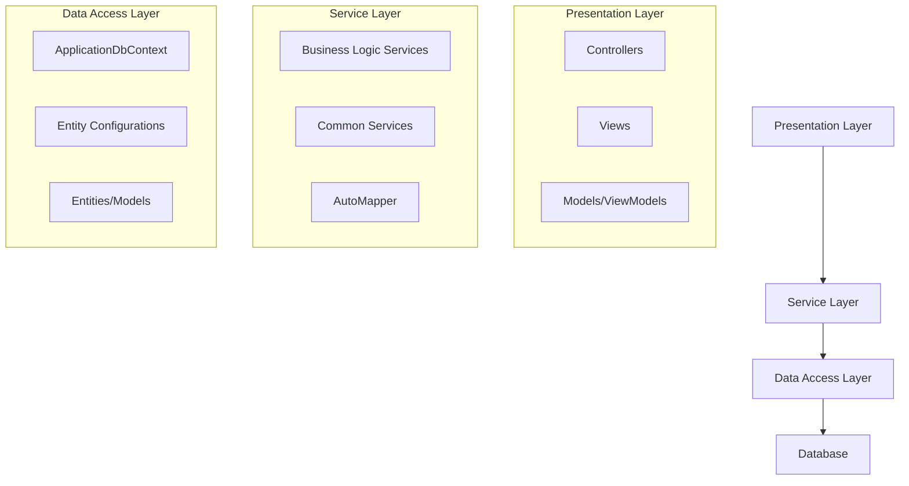

ESP Santa Fe de Antioquia is built using ASP.NET Core MVC following a layered architecture pattern with clear separation of concerns.

## Architecture Layers



## Project Structure

The solution is organized into multiple projects for better separation:

<Tabs>
  <Tab title="prjESPSantaFeAnt">
    The main web application project containing:
    - **Controllers**: MVC controllers handling HTTP requests
    - **Views**: Razor views for UI rendering
    - **Models**: View models for data transfer to views
    - **Areas**: Identity area for authentication pages
    - **Config**: Configuration classes (AutoMapper, etc.)
    - **Startup.cs**: Application configuration and DI setup
  </Tab>
  
  <Tab title="persistenDatabase">
    Data access layer containing:
    - **ApplicationDbContext**: EF Core database context
    - **Config**: Entity configuration classes
    - **Migrations**: Database migration files
  </Tab>
  
  <Tab title="model">
    Domain entities:
    - **Product**, **Category**, **Employee**, **PQRSD**
    - **Master**, **Document**, **BiddingParticipant**
    - Pure entity classes without dependencies
  </Tab>
  
  <Tab title="modelDTOs">
    Data Transfer Objects:
    - DTOs for API/service communication
    - Custom validation attributes
    - Separate create/edit/view DTOs
  </Tab>
  
  <Tab title="services">
    Business logic services:
    - Service interfaces and implementations
    - Common utilities (file upload, email, formatting)
    - Repository-like pattern for data access
  </Tab>
</Tabs>

## Core Design Patterns

### MVC Pattern

The application follows the Model-View-Controller pattern:

```csharp
// Controller: prjESPSantaFeAnt/Controllers/ProductsController.cs:11
public class ProductsController : Controller
{
    private readonly IProductService _productService;

    public ProductsController(IProductService productService)
    {
        _productService = productService;
    }

    // GET: Products
    public async Task<IActionResult> Index()
    {
        var _product = from a in await _productService.GetAll()
                       select new ModelViewProduct
                       {
                           ProductId = a.ProductId,
                           Icono = a.Icono,
                           Name = a.Name,
                           UrlProduct = a.UrlProduct
                       };

        return View(_product);
    }
}
```

<Note>
  Controllers are thin, delegating business logic to services. They only handle HTTP concerns like request validation, routing, and view selection.
</Note>

### Repository Pattern

While not using formal repositories, services act as a repository layer:

```csharp
// Service interface
public interface IProductService
{
    Task<IEnumerable<Product>> GetAll();
    Task<ProductDto> Details(int? id);
    Task<ProductDto> Create(ProductCreateDto model);
    Task DeleteConfirmed(int id);
    bool ProductExists(int id);
}
```

### Dependency Injection

All services and dependencies are registered in `Startup.cs:26`:

```csharp
public void ConfigureServices(IServiceCollection services)
{
    // Database Context
    services.AddDbContext<ApplicationDbContext>(options =>
        options.UseSqlServer(
            Configuration.GetConnectionString("DefaultConnection")));

    // Identity
    services.AddIdentity<IdentityUser, IdentityRole>(
        options => options.SignIn.RequireConfirmedAccount = true)
       .AddEntityFrameworkStores<ApplicationDbContext>()
       .AddDefaultTokenProviders();

    // AutoMapper
    services.AddAutoMapper(typeof(Startup));

    // Business Services
    services.AddTransient<ICategoryService, CategoryService>();
    services.AddTransient<IProductService, ProductService>();
    services.AddTransient<IEmployeeService, EmployeeService>();
    // ... more services

    // Common Services
    services.AddTransient<IUploadedFileIIS, UploadedFileIIS>();
    services.AddTransient<IEmailSendGrid, EmailSendGrid>();
}
```

## Request Pipeline

The middleware pipeline is configured in `Startup.cs:96`:


<Accordion title="Middleware Configuration Details">
  ```csharp
  public void Configure(IApplicationBuilder app, IWebHostEnvironment env)
  {
      if (env.IsProduction())
      {
          app.UseDeveloperExceptionPage();
          app.UseDatabaseErrorPage();
      }
      else
      {
          app.UseExceptionHandler("/Home/Error");
          app.UseHsts();
      }
      
      app.UseHttpsRedirection();
      app.UseStaticFiles();
      app.UseRouting();
      app.UseAuthentication();
      app.UseAuthorization();
      
      app.UseEndpoints(endpoints =>
      {
          endpoints.MapControllerRoute(
              name: "default",
              pattern: "{controller=Home}/{action=Index}/{id?}");
          endpoints.MapRazorPages();
      });
  }
  ```
</Accordion>

## Key Architectural Benefits

### Separation of Concerns
- **Presentation** logic isolated in controllers and views
- **Business** logic encapsulated in services
- **Data access** centralized in DbContext and configurations

### Testability
- Services use interfaces for easy mocking
- Constructor injection enables unit testing
- Business logic independent of web concerns

### Maintainability
- Clear project boundaries
- Single Responsibility Principle
- Easy to locate and modify functionality

### Scalability
- Stateless services
- Transient lifetime for most services
- Database connection pooling via EF Core

## Technology Stack

| Layer | Technology |
|-------|------------|
| Framework | ASP.NET Core 3.1 |
| ORM | Entity Framework Core |
| Database | SQL Server |
| Authentication | ASP.NET Core Identity |
| Mapping | AutoMapper |
| UI | Razor Views, MVC |
| Email | SendGrid |

## Configuration Management

Configuration is managed through:
- `appsettings.json` for application settings
- Connection strings in configuration
- Dependency injection for accessing `IConfiguration`

```csharp
// Startup.cs:18
public Startup(IConfiguration configuration)
{
    Configuration = configuration;
}

public IConfiguration Configuration { get; }
```

## Next Steps

<CardGroup cols={2}>
  <Card title="Database Schema" icon="database" href="/architecture/database-schema">
    Explore the database structure and entity relationships
  </Card>
  <Card title="Services Layer" icon="gears" href="/architecture/services-layer">
    Deep dive into business logic and service patterns
  </Card>
  <Card title="Authentication" icon="lock" href="/architecture/authentication">
    Learn about security and authentication implementation
  </Card>
</CardGroup>