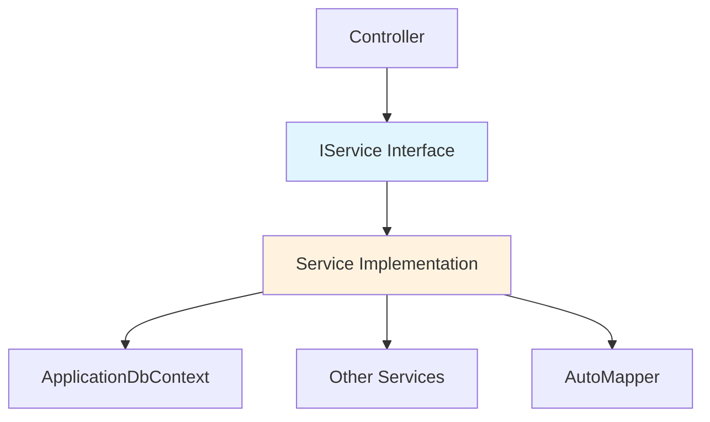

The service layer encapsulates all business logic and data access operations, providing a clean separation between controllers and the database.

## Service Layer Pattern

Services follow an interface-based design for dependency injection and testability:



## Service Registration

All services are registered in `Startup.cs:76` using the transient lifetime:

```csharp
public void ConfigureServices(IServiceCollection services)
{
    // AutoMapper
    services.AddAutoMapper(typeof(Startup));

    // Business Services
    services.AddTransient<ICategoryService, CategoryService>();
    services.AddTransient<INacionLicitanteService, NacionLicitanteService>();
    services.AddTransient<IBiddingParticipantService, BiddingParticipantService>();
    services.AddTransient<IDocumentService, DocumentService>();
    services.AddTransient<IBlogService, BlogService>();
    services.AddTransient<IPQRSDService, PQRSDService>();
    services.AddTransient<IBrigadeService, BrigadeService>();
    services.AddTransient<IProductService, ProductService>();
    services.AddTransient<IEmployeeService, EmployeeService>();

    // Common Services
    services.AddTransient<IUploadedFileIIS, UploadedFileIIS>();
    services.AddTransient<IFormatStringUrl, FormatStringUrl>();
    services.AddTransient<IEmailSendGrid, EmailSendGrid>();
}
```

<Note>
  **Transient Lifetime**: A new instance is created each time the service is requested. This is appropriate for lightweight, stateless services.
</Note>

## Core Service Pattern

<Tabs>
  <Tab title="Interface">
    Define a service interface with all operations:

    ```csharp
    // services/ProductService.cs:15
    public interface IProductService
    {
        Task<IEnumerable<Product>> GetAll();
        Task<ProductDto> Details(int? id);
        Task<ProductDto> Details(string urlProduct);
        Task<ProductDto> Create(ProductCreateDto model);
        Task<Product> GetById(int? id);
        Task DeleteConfirmed(int id);
        bool ProductExists(int id);
        bool DuplicaName(string _stringName);
    }
    ```

    **Benefits**:
    - Enables dependency injection
    - Facilitates unit testing with mocks
    - Documents available operations
    - Supports multiple implementations
  </Tab>

  <Tab title="Implementation">
    Implement the interface with actual business logic:

    ```csharp
    // services/ProductService.cs:26
    public class ProductService : IProductService
    {
        private readonly ApplicationDbContext _context;
        private readonly IMapper _mapper;
        private readonly IFormatStringUrl _formatStringUrl;

        public ProductService(
            ApplicationDbContext context,
            IMapper mapper,
            IFormatStringUrl formatStringUrl)
        {
            _context = context;
            _mapper = mapper;
            _formatStringUrl = formatStringUrl;
        }

        public async Task<IEnumerable<Product>> GetAll()
        {
            return await _context
                .Products
                .OrderByDescending(x => x.DateCreate)
                .ToListAsync();
        }

        public async Task<ProductDto> Details(int? id)
        {
            var product = await _context.Products
                .FirstOrDefaultAsync(m => m.ProductId == id);
                
            return _mapper.Map<ProductDto>(product);
        }
        
        // ... more methods
    }
    ```
  </Tab>

  <Tab title="Controller Usage">
    Controllers inject and use services:

    ```csharp
    // prjESPSantaFeAnt/Controllers/ProductsController.cs:11
    public class ProductsController : Controller
    {
        private readonly IProductService _productService;

        public ProductsController(IProductService productService)
        {
            _productService = productService;
        }

        public async Task<IActionResult> Index()
        {
            var products = from a in await _productService.GetAll()
                          select new ModelViewProduct
                          {
                              ProductId = a.ProductId,
                              Name = a.Name,
                              UrlProduct = a.UrlProduct
                          };

            return View(products);
        }
    }
    ```
  </Tab>
</Tabs>

## Service Examples

### ProductService

Manages product/service catalog operations:

<Accordion title="Full ProductService Implementation">
  ```csharp
  // services/ProductService.cs:26
  public class ProductService : IProductService
  {
      private readonly ApplicationDbContext _context;
      private readonly IMapper _mapper;
      private readonly IFormatStringUrl _formatStringUrl;

      public ProductService(
          ApplicationDbContext context,
          IMapper mapper,
          IFormatStringUrl formatStringUrl)
      {
          _context = context;
          _mapper = mapper;
          _formatStringUrl = formatStringUrl;
      }

      public async Task<ProductDto> Create(ProductCreateDto model)
      {
          var dateCreate = DateTime.Now;
          var urlProduct = _formatStringUrl.FormatString(model.Name);

          var product = new Product
          {
              ProductId = model.ProductId,
              Name = model.Name,
              UrlProduct = urlProduct.Trim(),
              Icono = model.Icono + ".svg",
              Description = model.Description,
              DateCreate = dateCreate
          };

          await _context.AddAsync(product);
          await _context.SaveChangesAsync();

          return _mapper.Map<ProductDto>(product);
      }

      public async Task DeleteConfirmed(int id)
      {
          _context.Remove(new Product { ProductId = id });
          await _context.SaveChangesAsync();
      }

      public bool DuplicaName(string stringName)
      {
          return _context.Products.Any(e => e.Name == stringName);
      }
  }
  ```
</Accordion>

**Key Features**:
- URL slug generation using `IFormatStringUrl`
- Duplicate name checking
- AutoMapper for entity-to-DTO conversion
- Async operations throughout

### CategoryService

Manages service categories with file upload:

```csharp
// services/CategoryService.cs:31
public class CategoryService : ICategoryService
{
    private readonly ApplicationDbContext _context;
    private readonly IMapper _mapper;
    private readonly IFormatStringUrl _formatStringUrl;
    private readonly IUploadedFileIIS _uploadedFileIIS;
    private readonly string _account = "categories";

    public async Task<CategoryDto> Create(CategoryCreateDto model)
    {
        var dateCreate = DateTime.Now;
        var urlCategory = _formatStringUrl.FormatString(model.NameCategory);
        var coverPage = _uploadedFileIIS.UploadedFileImage(
            model.CoverPage, _account);

        var category = new Category
        {
            Id = model.Id,
            NameCategory = model.NameCategory.Trim(),
            UrlCategory = urlCategory,
            Description = model.Description.Trim(),
            CoverPage = coverPage,
            Statud = model.Statud,
            DateCreate = dateCreate
        };

        await _context.AddAsync(category);
        await _context.SaveChangesAsync();

        return _mapper.Map<CategoryDto>(category);
    }

    public async Task Edit(int id, CategoryEditDto model)
    {
        var dateUpdate = DateTime.Now;
        var category = await _context.Categories.SingleAsync(x => x.Id == id);

        if (model.CoverPage != null)
        {
            var searchCoverPage = await _context.Categories
                .SingleAsync(x => x.Id == id);
            category.CoverPage = _uploadedFileIIS.UploadedFileImage(
                searchCoverPage.CoverPage, 
                model.CoverPage, 
                _account, 
                false);
        }

        category.Description = model.Description;
        category.Statud = model.Statud;
        category.DateUpdate = dateUpdate;

        await _context.SaveChangesAsync();
    }
}
```

**Key Features**:
- File upload handling with `IUploadedFileIIS`
- Image replacement during edits
- URL slug generation for SEO
- Automatic timestamp management

## Common Services

Utility services provide cross-cutting functionality:

<Tabs>
  <Tab title="File Upload">
    ```csharp
    // services/Commons/UploadedFileIIS.cs
    public interface IUploadedFileIIS
    {
        string UploadedFileImage(IFormFile file, string account);
        string UploadedFileImage(
            string oldFile, 
            IFormFile newFile, 
            string account, 
            bool delete);
        string UploadedFilePDF(IFormFile file, string account);
        void DeleteConfirmed(string fileName, string account);
    }
    ```

    **Responsibilities**:
    - Upload files to IIS directory
    - Replace existing files
    - Delete files
    - Organize by account/folder
  </Tab>

  <Tab title="URL Formatting">
    ```csharp
    // services/Commons/FormatStringUrl.cs
    public interface IFormatStringUrl
    {
        string FormatString(string input);
    }
    ```

    **Purpose**: Convert titles to URL-friendly slugs
    
    Example:
    - Input: `"Acueducto y Alcantarillado"`
    - Output: `"acueducto-y-alcantarillado"`
  </Tab>

  <Tab title="Email Service">
    ```csharp
    // services/Commons/EmailSendGrid.cs
    public interface IEmailSendGrid
    {
        Task<Response> SendEmail(
            string email, 
            string subject, 
            string message);
    }
    ```

    **Integration**: Uses SendGrid API for email delivery
    
    **Use Cases**:
    - PQRSD notifications
    - Account confirmations
    - Password resets
  </Tab>
</Tabs>

## AutoMapper Integration

AutoMapper handles entity-to-DTO conversions:

```csharp
// prjESPSantaFeAnt/Config/AutoMapperConfig.cs:11
public class AutoMapperConfig : Profile
{
    public AutoMapperConfig()
    {
        CreateMap<Master, NacionLicitanteDto>();
        CreateMap<Master, BlogDto>();
        CreateMap<Master, BrigadeDto>();
        CreateMap<Category, CategoryDto>();
        CreateMap<BiddingParticipant, BiddingParticipantDTO>();
        CreateMap<PQRSD, PQRSDDto>();
        CreateMap<Document, DocumentDTO>();
        CreateMap<Product, ProductDto>();
        CreateMap<Employee, EmployeeDto>();
    }
}
```

**Usage in Services**:
```csharp
// Convert entity to DTO
var productDto = _mapper.Map<ProductDto>(product);

// Convert collection
var productDtos = _mapper.Map<IEnumerable<ProductDto>>(products);
```

<Note>
  AutoMapper is registered in `Startup.cs:74` with `services.AddAutoMapper(typeof(Startup))`, which scans for all `Profile` classes.
</Note>

## Service Best Practices

### Async/Await Pattern

All database operations use async methods:

```csharp
public async Task<IEnumerable<Product>> GetAll()
{
    return await _context
        .Products
        .OrderByDescending(x => x.DateCreate)
        .ToListAsync();
}
```

**Benefits**:
- Non-blocking I/O operations
- Better scalability
- Improved responsiveness

### Dependency Injection

Services receive dependencies via constructor:

```csharp
public CategoryService(
    ApplicationDbContext context,
    IMapper mapper,
    IFormatStringUrl formatStringUrl,
    IUploadedFileIIS uploadedFileIIS)
{
    _context = context;
    _mapper = mapper;
    _formatStringUrl = formatStringUrl;
    _uploadedFileIIS = uploadedFileIIS;
}
```

**Benefits**:
- Loose coupling
- Testability with mocks
- Single Responsibility Principle

### DTO Pattern

Separate DTOs for different operations:

```csharp
// Create DTO - limited fields
public class ProductCreateDto
{
    public string Name { get; set; }
    public string Icono { get; set; }
    public string Description { get; set; }
}

// View DTO - all display fields
public class ProductDto
{
    public int ProductId { get; set; }
    public string Name { get; set; }
    public string UrlProduct { get; set; }
    public string Icono { get; set; }
    public string Description { get; set; }
    public DateTime DateCreate { get; set; }
}
```

**Benefits**:
- Prevent over-posting attacks
- Hide internal entity structure
- Optimize data transfer

## Error Handling

Services handle errors at appropriate levels:

```csharp
public async Task<Product> GetById(int? id)
{
    // Let EF Core throw if not found
    return await _context.Products
        .FirstOrDefaultAsync(x => x.ProductId == id);
}
```

Controllers check for null and return appropriate HTTP responses:

```csharp
public async Task<IActionResult> Details(int? id)
{
    if (id == null)
    {
        return NotFound();
    }

    var product = await _productService.Details(id);
    
    if (product == null)
    {
        return NotFound();
    }

    return View(product);
}
```

## Service Composition

Services can depend on other services:

```csharp
public class CategoryService : ICategoryService
{
    private readonly ApplicationDbContext _context;
    private readonly IMapper _mapper;
    private readonly IFormatStringUrl _formatStringUrl;  // Common service
    private readonly IUploadedFileIIS _uploadedFileIIS;  // Common service

    // Both common services injected via DI
    public CategoryService(
        ApplicationDbContext context,
        IMapper mapper,
        IFormatStringUrl formatStringUrl,
        IUploadedFileIIS uploadedFileIIS)
    {
        _context = context;
        _mapper = mapper;
        _formatStringUrl = formatStringUrl;
        _uploadedFileIIS = uploadedFileIIS;
    }
}
```

## Testing Services

Interface-based design enables easy unit testing:

```csharp
// Mock the service in tests
var mockProductService = new Mock<IProductService>();
mockProductService
    .Setup(s => s.GetAll())
    .ReturnsAsync(new List<Product> { /* test data */ });

// Inject mock into controller
var controller = new ProductsController(mockProductService.Object);
```

## Service Layer Benefits

<CardGroup cols={2}>
  <Card title="Testability" icon="flask">
    Interface-based design allows easy mocking and unit testing
  </Card>
  <Card title="Reusability" icon="recycle">
    Business logic can be reused across multiple controllers
  </Card>
  <Card title="Maintainability" icon="wrench">
    Centralized logic is easier to modify and debug
  </Card>
  <Card title="Separation of Concerns" icon="layer-group">
    Clear boundaries between presentation and business logic
  </Card>
</CardGroup>

## Next Steps

<CardGroup cols={2}>
  <Card title="Authentication" icon="lock" href="/architecture/authentication">
    Learn about security and user management
  </Card>
  <Card title="API Reference" icon="book" href="/api/services">
    Explore service implementations
  </Card>
  <Card title="Controllers" icon="route" href="/api/controllers">
    See how controllers use services
  </Card>
  <Card title="Database Schema" icon="database" href="/architecture/database-schema">
    Understand the data layer
  </Card>
</CardGroup>